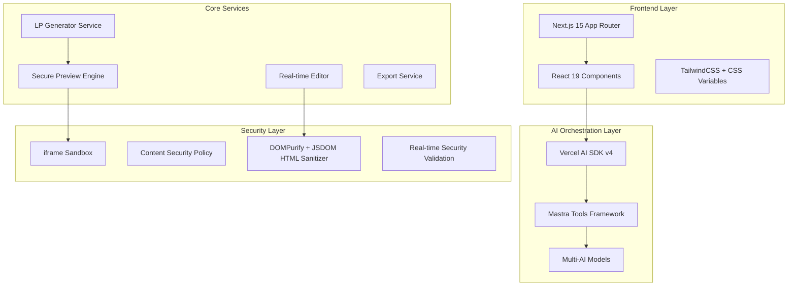

# Design Document

## Overview

LP Creator は、AIを活用した高品質ランディングページ自動生成・編集SaaSプラットフォームです。Next.js 15 + React 19 + TailwindCSS をベースとし、マーケティング心理学（PASONA法則・4U原則）とモダンWeb技術を組み合わせた自律型AI生成システムを提供します。

本システムは、自然言語入力から完全なランディングページを生成し、リアルタイムプレビュー、インライン編集、複数バリエーション生成、AI改善提案などの高度な機能を統合したワンストップソリューションです。

## Architecture

### System Architecture



### Technology Stack

| Layer | Technology | Purpose |
|-------|-----------|---------|
| Frontend | Next.js 15 + React 19 | App Router, Server/Client Components, Edge Runtime |
| Styling | TailwindCSS + CSS Variables | Responsive design, dark mode support |
| AI Orchestration | Vercel AI SDK v4 + Mastra | Multi-model support, tool injection |
| State Management | React Context + useChat Hook | Edit mode and chat session separation |
| Security | iframe sandbox + CSP | Complete isolation of AI-generated HTML |
| Performance | Edge Runtime + Streaming | Real-time response and optimization |

## コンポーネントとインターフェース

### コアコンポーネント

#### 1. Main Application (`page.tsx`)
- **Purpose**: メインアプリケーションコンテナ
- **Responsibilities**:
  - チャットセッション管理
  - 編集モード制御
  - LP生成状態管理
  - UI レイアウト調整

#### 2. LP Generator Tools
- **enhancedLPGeneratorTool**: 基本的なLP生成
- **intelligentLPGeneratorTool**: 複数バリエーション生成
- **htmlLPTool**: HTML特化生成
- **lpPreviewTool**: プレビュー専用生成

#### 3. Preview and Editing Components

```typescript
interface LPViewerProps {
  htmlContent: string;
  cssContent: string;
  onTextUpdate: (elementId: string, newText: string) => void;
  onAIImprove: (elementId: string, currentText: string) => void;
  isModalOpen: boolean;
}

interface EditModalProps {
  isOpen: boolean;
  elementId: string | null;
  currentText: string;
  onSave: (elementId: string, newText: string) => void;
  onClose: () => void;
  isUpdating: boolean;
}
```

#### 4. AI Enhancement Components

```typescript
interface VariantSelectorProps {
  variants: LPVariant[];
  selectedVariant: LPVariant | null;
  onSelectVariant: (variant: LPVariant) => void;
  isVisible: boolean;
}

interface AISuggestionPanelProps {
  suggestions: AISuggestion[];
  onApplySuggestion: (suggestion: AISuggestion) => void;
  isVisible: boolean;
}
```
### データモデル

#### LP生成モデル

```typescript
interface LPGenerationRequest {
  userInput: string;
  businessType?: string;
  targetAudience?: string;
  goals?: string[];
  style?: 'modern' | 'classic' | 'minimal' | 'bold';
}

interface LPGenerationResult {
  htmlContent: string;
  cssContent: string;
  title: string;
  metadata: {
    generatedAt: Date;
    model: string;
    processingTime: number;
  };
}

interface LPVariant extends LPGenerationResult {
  variantId: string;
  score: number;
  description: string;
  features: string[];
}
```

#### 編集モデル

```typescript
interface EditableElement {
  id: string;
  type: 'text' | 'heading' | 'button' | 'image';
  content: string;
  position: {
    x: number;
    y: number;
    width: number;
    height: number;
  };
}

interface EditOperation {
  elementId: string;
  operation: 'update' | 'delete' | 'insert';
  oldValue: string;
  newValue: string;
  timestamp: Date;
}
```

#### AI提案モデル

```typescript
interface AISuggestion {
  id: string;
  type: 'content' | 'design' | 'structure' | 'seo';
  title: string;
  description: string;
  impact: 'low' | 'medium' | 'high';
  action: {
    type: 'replace' | 'insert' | 'modify';
    target: string;
    value: string;
  };
}
```

### State Management Architecture

```typescript
interface AppState {
  // Chat and Generation State
  messages: Message[];
  isLoading: boolean;
  error: Error | null;
  
  // LP Content State
  lpToolState: {
    isActive: boolean;
    htmlContent: string;
    cssContent: string;
    title: string;
    forcePanelOpen: boolean;
  };
  
  // Edit Mode State
  editMode: {
    isEnabled: boolean;
    selectedElementId: string | null;
    isModalOpen: boolean;
    editingText: string;
    isUpdating: boolean;
  };
  
  // Enhancement Features State
  variants: LPVariant[];
  selectedVariant: LPVariant | null;
  showVariantSelector: boolean;
  aiSuggestions: AISuggestion[];
  showAISuggestions: boolean;
}
```

## Error Handling

### Error Categories and Handling Strategy

#### 1. AI Generation Errors
```typescript
interface AIGenerationError {
  type: 'model_timeout' | 'rate_limit' | 'invalid_response' | 'content_policy';
  message: string;
  retryable: boolean;
  retryAfter?: number;
}

// Error Handling Strategy
const handleAIError = (error: AIGenerationError) => {
  switch (error.type) {
    case 'model_timeout':
      return { 
        action: 'retry', 
        delay: 2000,
        fallbackModel: 'gpt-3.5-turbo' 
      };
    case 'rate_limit':
      return { 
        action: 'queue', 
        delay: error.retryAfter || 60000 
      };
    case 'content_policy':
      return { 
        action: 'sanitize_and_retry',
        message: 'コンテンツを調整して再試行します' 
      };
    default:
      return { 
        action: 'user_notification',
        message: error.message 
      };
  }
};
```

#### 2. Security and Sanitization Errors
```typescript
interface SecurityError {
  type: 'xss_detected' | 'unsafe_html' | 'script_injection';
  element: string;
  severity: 'low' | 'medium' | 'high';
}

const sanitizeHTML = (html: string): string => {
  // DOMPurify integration for HTML sanitization
  // Remove dangerous scripts, iframes, and event handlers
  // Preserve safe styling and structure
};
```

#### 3. Performance and Resource Errors
```typescript
interface PerformanceError {
  type: 'memory_limit' | 'processing_timeout' | 'large_content';
  threshold: number;
  current: number;
}

const handlePerformanceError = (error: PerformanceError) => {
  if (error.type === 'large_content') {
    return {
      action: 'chunk_processing',
      chunkSize: 50000 // 50KB chunks
    };
  }
};
```## Test
ing Strategy

### Testing Pyramid

#### 1. Unit Tests
- **AI Tool Functions**: 各Mastraツールの入出力テスト
- **Component Logic**: React コンポーネントの状態管理とイベント処理
- **Utility Functions**: HTML sanitization, text extraction, format conversion
- **Error Handling**: エラーケースの適切な処理確認

```typescript
// Example: AI Tool Unit Test
describe('enhancedLPGeneratorTool', () => {
  it('should generate valid HTML from business description', async () => {
    const input = { businessDescription: 'AI写真編集アプリ' };
    const result = await enhancedLPGeneratorTool.execute(input);
    
    expect(result.htmlContent).toContain('<!DOCTYPE html>');
    expect(result.title).toBeTruthy();
    expect(result.cssContent).toBeTruthy();
  });
});
```

#### 2. Integration Tests
- **AI Model Integration**: 複数AIモデルとの連携テスト
- **Component Integration**: コンポーネント間の連携動作確認
- **State Management**: 複雑な状態変更シナリオのテスト
- **Security Integration**: サンドボックス環境での安全性確認

```typescript
// Example: Integration Test
describe('LP Generation Flow', () => {
  it('should complete full generation and editing cycle', async () => {
    // 1. Generate LP
    const generationResult = await generateLP(userInput);
    expect(generationResult.htmlContent).toBeTruthy();
    
    // 2. Enable edit mode
    const editableElements = extractEditableElements(generationResult.htmlContent);
    expect(editableElements.length).toBeGreaterThan(0);
    
    // 3. Perform edit operation
    const updatedContent = await updateElement(editableElements[0].id, 'New text');
    expect(updatedContent).toContain('New text');
  });
});
```

#### 3. End-to-End Tests
- **User Journey Tests**: 完全なユーザーワークフローのテスト
- **Cross-browser Testing**: 主要ブラウザでの動作確認
- **Performance Testing**: 大量コンテンツ処理時のパフォーマンス
- **Security Testing**: XSS、インジェクション攻撃の防御確認

```typescript
// Example: E2E Test with Playwright
test('Complete LP creation and editing workflow', async ({ page }) => {
  // Navigate to application
  await page.goto('/');
  
  // Input business description
  await page.fill('input[placeholder*="例：AI写真編集アプリ"]', 'AI写真編集アプリのランディングページ');
  await page.click('button:has-text("生成")');
  
  // Wait for LP generation
  await page.waitForSelector('iframe[title="LP Preview"]');
  
  // Enable edit mode
  await page.click('button:has-text("編集モード")');
  
  // Edit content
  await page.click('[data-editable-id="hero-title"]');
  await page.fill('textarea', '新しいタイトル');
  await page.click('button:has-text("保存")');
  
  // Verify changes
  const iframeContent = await page.frameLocator('iframe').textContent();
  expect(iframeContent).toContain('新しいタイトル');
});
```

### Testing Tools and Configuration

```typescript
// Jest Configuration
export default {
  testEnvironment: 'jsdom',
  setupFilesAfterEnv: ['<rootDir>/tests/setup.ts'],
  moduleNameMapping: {
    '^@/(.*)$': '<rootDir>/src/$1',
    '^@/app/(.*)$': '<rootDir>/app/$1'
  },
  collectCoverageFrom: [
    'src/**/*.{ts,tsx}',
    'app/**/*.{ts,tsx}',
    '!**/*.d.ts',
    '!**/node_modules/**'
  ],
  coverageThreshold: {
    global: {
      branches: 80,
      functions: 80,
      lines: 80,
      statements: 80
    }
  }
};

// Playwright Configuration
export default {
  testDir: './tests/e2e',
  timeout: 30000,
  use: {
    baseURL: 'http://localhost:3000',
    trace: 'on-first-retry',
    screenshot: 'only-on-failure'
  },
  projects: [
    { name: 'chromium', use: { ...devices['Desktop Chrome'] } },
    { name: 'firefox', use: { ...devices['Desktop Firefox'] } },
    { name: 'webkit', use: { ...devices['Desktop Safari'] } }
  ]
};
```

### Performance Testing Strategy

```typescript
// Performance Benchmarks
const performanceBenchmarks = {
  lpGeneration: {
    target: '< 10 seconds',
    acceptable: '< 15 seconds',
    critical: '< 30 seconds'
  },
  editOperation: {
    target: '< 100ms',
    acceptable: '< 500ms',
    critical: '< 1000ms'
  },
  previewRender: {
    target: '< 200ms',
    acceptable: '< 1000ms',
    critical: '< 2000ms'
  }
};

// Memory Usage Monitoring
const monitorMemoryUsage = () => {
  const memoryInfo = (performance as any).memory;
  if (memoryInfo) {
    console.log({
      usedJSHeapSize: memoryInfo.usedJSHeapSize,
      totalJSHeapSize: memoryInfo.totalJSHeapSize,
      jsHeapSizeLimit: memoryInfo.jsHeapSizeLimit
    });
  }
};
```## Security
 Considerations

### Content Security Policy (CSP)

```typescript
export const CSP_DIRECTIVES = {
  'default-src': ["'self'"],
  'script-src': ["'self'", "'unsafe-inline'", 'https://cdn.tailwindcss.com'],
  'style-src': ["'self'", "'unsafe-inline'", 'https://fonts.googleapis.com'],
  'font-src': ["'self'", 'https://fonts.gstatic.com'],
  'img-src': ["'self'", 'data:', 'https:', 'blob:'],
  'connect-src': ["'self'"],
  'frame-src': ["'none'"],
  'object-src': ["'none'"],
  'base-uri': ["'self'"],
  'form-action': ["'self'"]
};

// Generate CSP header string
const cspHeader = generateCSPHeader();
// Result: "default-src 'self'; script-src 'self' 'unsafe-inline' https://cdn.tailwindcss.com; ..."
```

### HTML Sanitization Strategy

```typescript
// Multi-environment sanitization with DOMPurify + JSDOM
import { sanitizeHTMLServer, sanitizeHTMLClient } from '@/utils/htmlSanitizer';

const sanitizationConfig = {
  allowedTags: [
    'div', 'span', 'p', 'h1', 'h2', 'h3', 'h4', 'h5', 'h6',
    'a', 'img', 'button', 'section', 'header', 'footer', 'nav',
    'ul', 'ol', 'li', 'strong', 'em', 'br', 'hr', 'blockquote',
    'main', 'article', 'aside', 'figure', 'figcaption',
    'table', 'thead', 'tbody', 'tr', 'th', 'td',
    'form', 'input', 'textarea', 'select', 'option', 'label'
  ],
  allowedAttributes: {
    '*': ['class', 'id', 'data-editable-id', 'style'],
    'a': ['href', 'target', 'rel', 'title'],
    'img': ['src', 'alt', 'width', 'height', 'loading'],
    'button': ['type', 'disabled', 'aria-label'],
    'input': ['type', 'name', 'value', 'placeholder', 'required', 'disabled'],
    'form': ['action', 'method', 'novalidate']
  },
  forbiddenTags: ['script', 'iframe', 'object', 'embed', 'applet', 'meta', 'link'],
  forbiddenAttributes: ['onload', 'onerror', 'onclick', 'onmouseover', 'javascript:', 'vbscript:']
};

// Server-side sanitization
const cleanHTML = sanitizeHTMLServer(aiGeneratedHTML);

// Client-side sanitization
const cleanHTML = sanitizeHTMLClient(userHTML);

// Additional security validation
const { isSecure, violations } = performSecurityChecks(html);
```

### Iframe Sandbox Configuration

```typescript
export const SANDBOX_ATTRIBUTES = [
  'allow-scripts',        // JavaScript実行を許可
  'allow-same-origin',    // 同一オリジンアクセスを許可（編集機能用）
  'allow-forms'           // フォーム送信を許可
];

// 危険な権限は明示的に除外
const forbiddenSandboxPermissions = [
  'allow-top-navigation',     // トップレベルナビゲーション禁止
  'allow-popups',            // ポップアップ禁止
  'allow-downloads',         // ダウンロード禁止
  'allow-pointer-lock'       // ポインターロック禁止
];

// 追加のセキュリティ検証
const { isSecure, violations } = performSecurityChecks(html);
if (!isSecure) {
  console.warn('Security violations detected:', violations);
  // セキュリティ違反の適切な処理
}
```

## Performance Optimization

### Code Splitting Strategy

```typescript
// Dynamic imports for heavy components
const VariantSelector = dynamic(() => import('../components/VariantSelector'), {
  loading: () => <div>Loading variants...</div>,
  ssr: false
});

const AISuggestionPanel = dynamic(() => import('../components/AISuggestionPanel'), {
  loading: () => <div>Loading suggestions...</div>,
  ssr: false
});
```

### Memory Management

```typescript
// Cleanup strategies for large HTML content
const cleanupLargeContent = () => {
  // Clear unused variants
  if (variants.length > 5) {
    setVariants(variants.slice(0, 3));
  }
  
  // Clear old AI suggestions
  if (aiSuggestions.length > 10) {
    setAiSuggestions(aiSuggestions.slice(0, 5));
  }
  
  // Force garbage collection hint
  if (window.gc) {
    window.gc();
  }
};
```

### Streaming and Progressive Loading

```typescript
// Progressive content loading
const streamLPGeneration = async (userInput: string) => {
  const stream = await fetch('/api/lp-creator/stream', {
    method: 'POST',
    body: JSON.stringify({ userInput }),
    headers: { 'Content-Type': 'application/json' }
  });
  
  const reader = stream.body?.getReader();
  let partialContent = '';
  
  while (reader) {
    const { done, value } = await reader.read();
    if (done) break;
    
    partialContent += new TextDecoder().decode(value);
    
    // Update UI progressively
    setLpToolState(prev => ({
      ...prev,
      htmlContent: partialContent,
      isActive: true
    }));
  }
};
```

## Accessibility Compliance

### WCAG 2.1 AA Standards

```typescript
const accessibilityFeatures = {
  keyboardNavigation: {
    tabIndex: 'sequential',
    focusManagement: 'automatic',
    skipLinks: true
  },
  screenReader: {
    ariaLabels: 'comprehensive',
    altText: 'descriptive',
    headingStructure: 'hierarchical'
  },
  colorContrast: {
    minimum: '4.5:1',
    large: '3:1',
    nonText: '3:1'
  },
  responsive: {
    zoomSupport: '200%',
    textResize: 'flexible',
    orientation: 'both'
  }
};
```

### Generated Content Accessibility

```typescript
const ensureAccessibleGeneration = (htmlContent: string): string => {
  // Add missing alt attributes
  htmlContent = htmlContent.replace(
    /]*alt=)/g, 
    '<img alt="Generated image"'
  );
  
  // Ensure proper heading hierarchy
  htmlContent = validateHeadingStructure(htmlContent);
  
  // Add ARIA landmarks
  htmlContent = addAriaLandmarks(htmlContent);
  
  return htmlContent;
};
```

## Deployment Architecture

### Edge Runtime Configuration

```typescript
export const runtime = 'edge';

export default async function handler(request: Request) {
  // Edge-optimized LP generation
  const response = await generateLPAtEdge(request);
  
  return new Response(response, {
    headers: {
      'Cache-Control': 'public, max-age=300, s-maxage=600',
      'Content-Type': 'application/json',
      'X-Edge-Location': process.env.VERCEL_REGION || 'unknown'
    }
  });
}
```

### CDN and Caching Strategy

```typescript
const cachingStrategy = {
  staticAssets: {
    maxAge: '1 year',
    immutable: true,
    compression: 'gzip, brotli'
  },
  generatedContent: {
    maxAge: '5 minutes',
    staleWhileRevalidate: '1 hour',
    vary: 'User-Agent, Accept-Language'
  },
  apiResponses: {
    maxAge: '30 seconds',
    private: true,
    noStore: false
  }
};
```