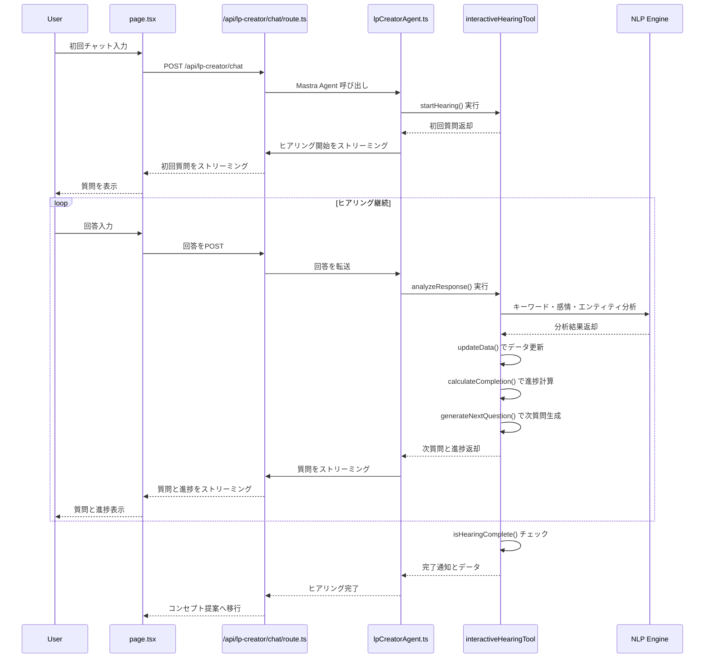
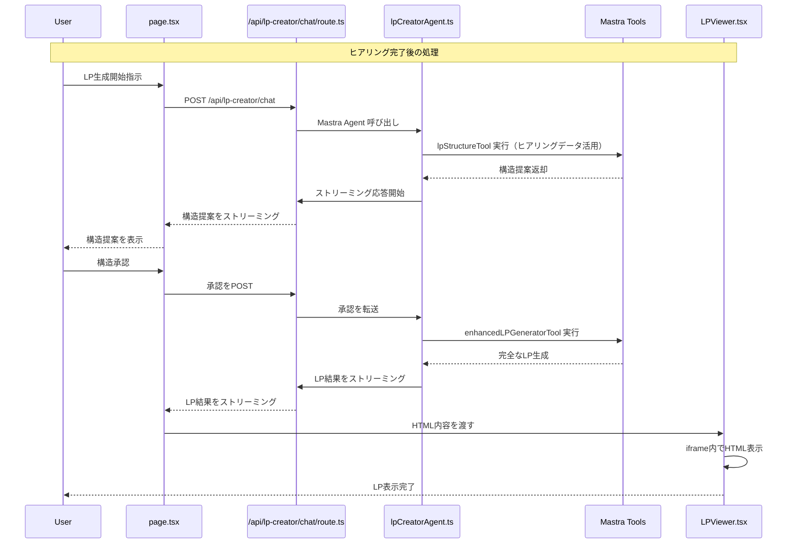
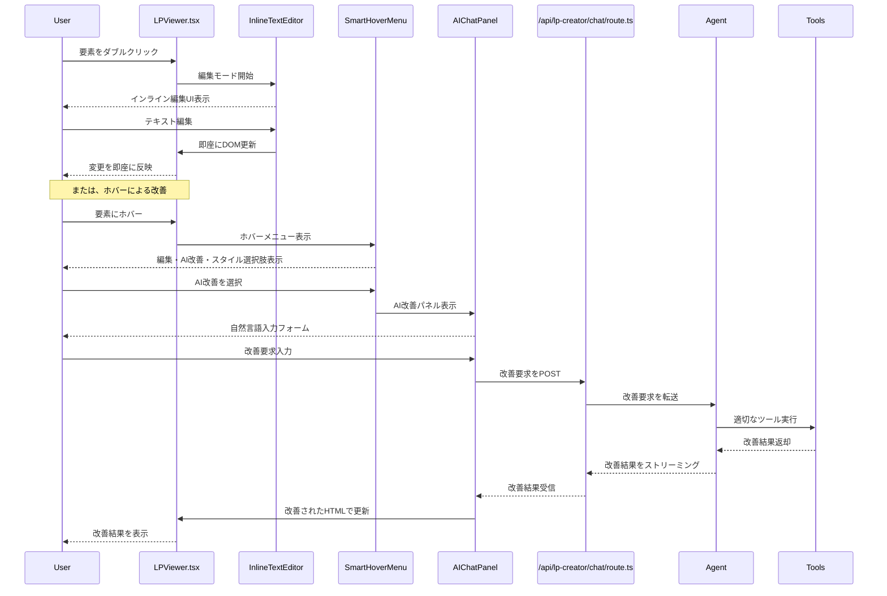
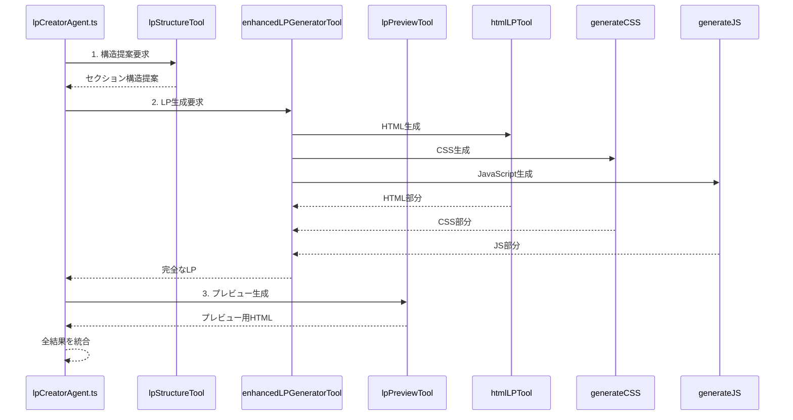
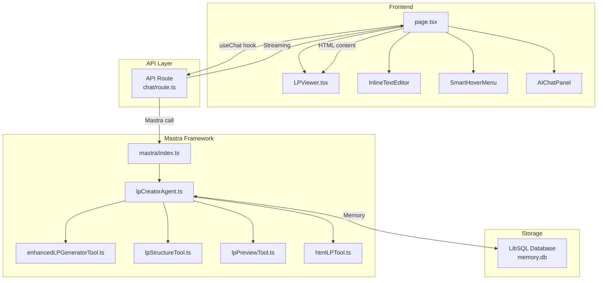
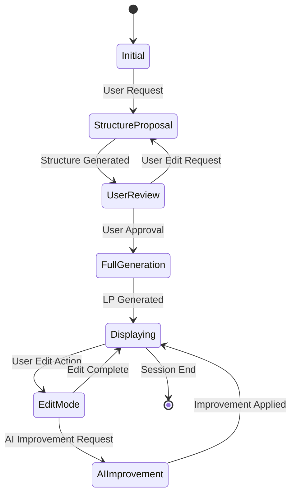

# LP Creator 処理シーケンス図

## 概要
LP Creator の主要な処理フローを示すシーケンス図です。ユーザーの入力からLP生成・表示までの流れを詳細に記載しています。

## 1. インタラクティブヒアリング処理フロー

## 2. メイン処理フロー（LP生成）

## 3. 編集モード処理フロー

## 4. ツールシステム詳細フロー

## 4. データフロー図

## 5. 状態管理フロー

## 技術スタック

- **Frontend**: Next.js 15.2.2, React (最新18.x系), TypeScript 5.8.2
- **AI Framework**: Mastra
- **API**: Next.js API Routes with Streaming
- **Database**: LibSQL (../memory.db)
- **Styling**: Tailwind CSS
- **AI Models**: Claude 3.7 Sonnet, OpenAI GPT-4.1 (mini/nano含む), Google Gemini

## 主要な特徴

1. **ストリーミング応答**: リアルタイムでAIの応答を表示
2. **構造提案と承認**: ユーザーが構造を確認・編集可能
3. **即座の編集反映**: チャット不要のインライン編集
4. **自然言語改善**: AI による自然言語での改善要求
5. **動的モデル選択**: 複数のAIプロバイダーをサポート