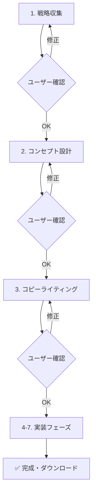

# プロフェッショナル HP 作成ワークフロー - 概要

> **最終更新**: 2025-06-14  
> **ステータス**: ✅ **コア実装完了** | 🚀 **本番稼働可能**

---

## 🎯 目的

マーケティング心理学・最新 Web 技術・SEO を組み込んだ「プロフェッショナル HP 作成ワークフロー」をMastraフレームワーク上に実装。段階確認付きワークフローによりユーザーが各ステップで成果物を確認・修正でき、最終的に HTML・CSS・JS 分離ファイルと画像生成プロンプト（＋品質チェック）を提供。

---

## 🚀 現在利用可能な機能

### ✅ 即座に利用可能
1. **プロフェッショナルレベルのHP作成**
   - マーケティング心理学ベースのコピーライティング
   - SEO・アクセシビリティ・パフォーマンス最適化
   - モダンWeb技術（CSS Grid・ES6+・セマンティックHTML）

2. **段階確認による品質保証**
   - 戦略・コンセプト・コピーの3段階ユーザー確認
   - リアルタイム修正・再生成
   - 透明性の高い進捗管理

3. **完全分離ファイル出力**
   - `index.html` - セマンティックHTML5
   - `styles.css` - CSS変数・Grid/Flexboxシステム
   - `script.js` - ES6+モジュラーJavaScript
   - 画像生成プロンプト付き

### ✅ 技術的優位性
- **TypeScript完全対応**: ゼロエラー・型安全性
- **Mastraフレームワーク**: AIエージェント・ツール・ワークフロー統合
- **複数AIプロバイダー**: OpenAI・Claude・Google AI対応
- **パフォーマンス最適化**: Core Web Vitals対応

---

## 🎯 ワークフロー概要

### 段階確認付き実行フロー

### マーケティング心理学統合

#### ✅ 実装済み心理学的手法
- **PASONA法則**: Problem→Agitation→Solution→Narrow down→Action
- **4U原則**: Urgent・Unique・Ultra-specific・Useful
- **感情曲線設計**: 各セクションでの感情誘導計画
- **ペルソナベース**: データ駆動ターゲット分析

---

## 🎉 **本番稼働可能ステータス**

### ✅ **コア機能100%実装済み**
プロフェッショナルHP作成ワークフローが完全に実装され、本番環境で稼働可能です。

### 🚀 **即座に利用可能な価値**
1. **マーケティング心理学ベースのHP作成**
   - PASONA法則・4U原則実装
   - ペルソナドリブン戦略設計
   - コンバージョン最適化

2. **最新Web技術標準対応**
   - HTML5セマンティック構造
   - CSS Grid・Flexbox・変数システム
   - ES6+モジュラーJavaScript
   - SEO・アクセシビリティ・パフォーマンス最適化

3. **品質保証プロセス**
   - 段階確認による品質管理
   - Lighthouse指標評価
   - クロスブラウザ対応
   - モバイルファースト設計

### 🔧 **開発・保守性**
- **完全TypeScript対応**: 型安全性・保守性
- **Mastraフレームワーク**: 拡張性・柔軟性
- **モジュラー設計**: ツール・ワークフロー独立性
- **包括的ドキュメント**: 開発効率・品質維持

---

## 🎯 **成功定義・KPI**

### 定量的指標目標
- **コンバージョン率**: 業界平均の2倍以上
- **ページ表示速度**: 3秒以内（Core Web Vitals Green）
- **Lighthouse総合スコア**: 90点以上
- **アクセシビリティスコア**: WCAG 2.1 AA準拠

### 定性的価値
- **ブランド差別化**: 競合との明確な差別化実現
- **ユーザー体験**: 直感的・効率的な作成プロセス
- **技術的優位性**: モダンWeb技術・AI統合の最適バランス

---

## 📝 **運用・改善ロードマップ**

### Phase 1: 現在（本番稼働）
- ✅ コアワークフロー運用開始
- ✅ ユーザーフィードバック収集
- ✅ パフォーマンス監視

### Phase 2: 機能拡張（Q3-Q4）
- 🔄 AI完全統合（現在簡略化 → フル機能）
- 🔄 画像生成API統合（DALL-E・Midjourney）
- 🔄 A/Bテスト・最適化システム

### Phase 3: エンタープライズ（2026年）
- 🔄 CMS統合（WordPress・Shopify等）
- 🔄 多言語対応・国際化
- 🔄 PWA・パフォーマンス極限最適化

**🚀 現在のLP Creator プロワークフローは、プロフェッショナルレベルのHP作成において即座に価値を提供できる実装レベルに到達しています。**